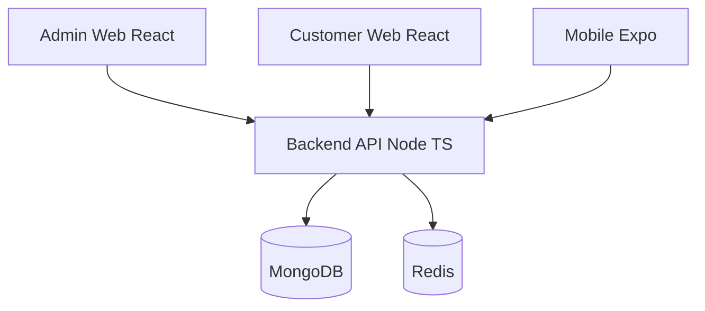
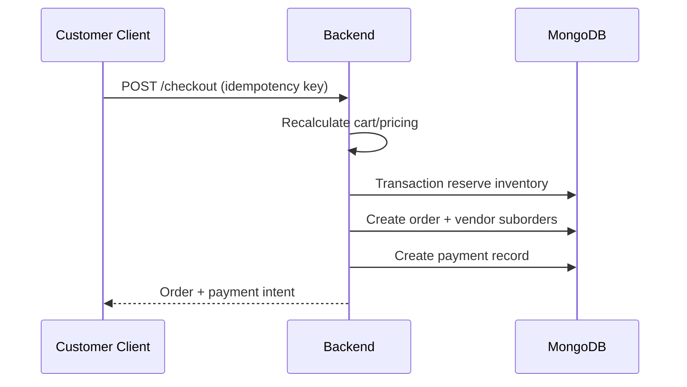

# Architecture

## System overview

## Domain modules (backend)

| Module | Responsibility |
|--------|----------------|
| auth / users | JWT auth, sessions, RBAC |
| configuration | Admin-controlled business settings |
| categories / products | Catalog, variants, Tamil/English fields |
| vendors | GeoJSON locations, service/delivery radius |
| pricing / offers | Vendor comparison, best price engine |
| inventory | Atomic reserve/release/sale |
| cart / checkout | Multi-vendor cart, idempotent checkout |
| orders | Parent order + vendor suborders, state machine |
| payments | Provider abstraction (COD implemented) |
| notifications | Domain events → in-app notifications |
| reports | Admin dashboard aggregates |

## Checkout flow

## Business configuration rule

Admin portal and configuration collections are the source of **business settings**.  
Customer web/mobile only **render API data** — no hardcoded categories, vendors, prices, or tax rates.
